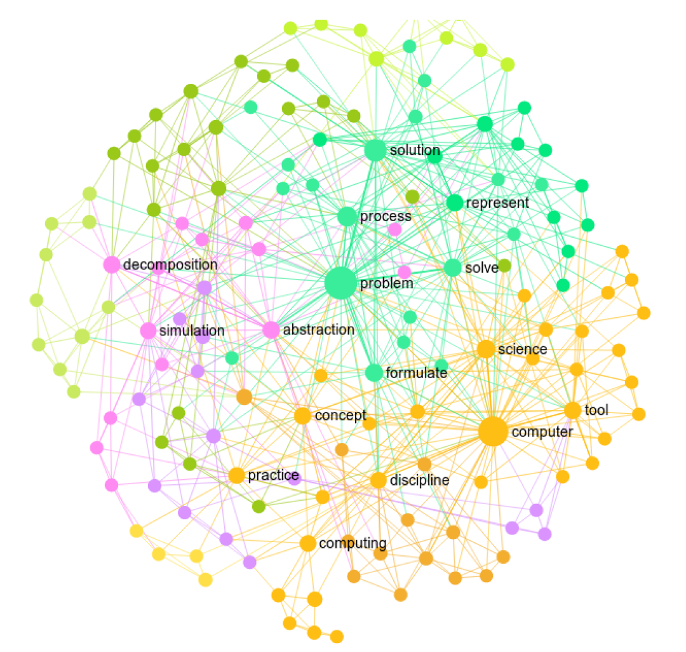

```{r setup, include=FALSE}
knitr::opts_chunk$set(echo = TRUE)
```

## 0. INTRODUCTION

In the Unit 4 walkthrough, we will replicate a simpler version of the
following paper: [Not the same: a text network analysis on computational
thinking definitions to study its relationship with computer
programming](https://www.researchgate.net/publication/338188953_Not_the_same_a_text_network_analysis_on_computational_thinking_definitions_to_study_its_relationship_with_computer_programming).
This paper reviews definitions for computational thinking in the
literature. You might have noticed that in our field, the same
terminology could mean different things, especially for emerging
terminologies such as computational thinking. This paper contributes to
understandings how different research teams conceptualize computational
thinking.

### Walkthrough Focus

Similar to previous walkthroughs, we should first understand the context
and dataset by reading the paper (prepare), and then wrangle the data
(wrangle), and then explore and visualize our data (explore &
communicate).

------------------------------------------------------------------------

## 1. PREPARE

To help us better understand the context, questions, and data sources,
this section will focus on the following topics:

a.  **Context**. This paper examines definitions of computational
    thinking from the literature.
b.  **Questions.** [Question for you]
c.  **Project Setup.** This should be very familiar by now, but we'll
    set up a new R project and install and load the required packages
    for the walkthrough.

### 1a. Context

#### Not the same: a text network analysis on computational thinking definitions to study its relationship with computer programming

**Abstract**

Even though countries from all over the world are modifying their
national educational curriculum in order to include computational
thinking skills, there is not an agreement in the definition of this
ability. This is partly caused by the myriad of definitions that has
been proposed by the scholar community. In fact, there are multiple
examples in educational scenarios in which coding and even robotics are
considered as synonymous of computational thinking. This paper presents
a text network analysis of the main definitions of this skill that have
been found in the literature, aiming to offer insights on the common
characteristics they share and on their relationship with computer
programming. As a result, a new definition of computational thinking is
proposed, which emerge from the analysed data.

**Data Source**

##### ✅ Comprehension Check

Based on your reading, what's the data source in this paper?

### 1b. Guiding Questions

##### ✅ Comprehension Check

What's the research question in this paper? Why is text network analysis
an appropriate methodology to address the research question?

### 1c. Set Up

As highlighted in [Chapter 6 of Data Science in Education Using
R](https://datascienceineducation.com/c06.html) (DSIEUR), one of the
first steps of every workflow should be to set up a "Project" within
RStudio. This will be your "home" for any files and code used or created
in previous units.

You are welcome to continue using the same project created for previous
units, or create an entirely new project for Unit 4. However, after
you've created your project open up a new R script, and load the
following packages that we'll be needing for this walkthrough:

```{r load-packages, message=FALSE}
library(dplyr)
library(tidytext)
library(tidyverse)
library(tidyr)
library(ggplot2)
library(igraph)
library(ggraph)
```

At the end of this week, I encourage you share with me your R script as
evidence that you have complete the walkthrough. Although I highly
recommend that that you manually type the code shared throughout this
walkthrough, for large blocks of text it may be easier to copy and
paste.

------------------------------------------------------------------------

## 2. WRANGLE

### 2a. Import Data

Now let's read our data into our Environment using the `read_csv()`
function and assign it to a variable name so we can work with it like
any other object in R.

```{r read-csv}
CTdefinition <- read_csv("data/definition.csv")
```

We can see that we have 8 different definitions for CT (computational
thinking). The definitions were taken from the paper. The paper includes
more than 8 definitions. Here, we use 8 definitions as an exemplar
dataset.

### 2b. Tokenizing text into bigrams

Next, we will use some familiar `tidytext` functions for tokenizing
text. But this time, we will tokenize bigram, instead of unigrams (or
single words) in the sentiment analysis unit. We can also tokenize
trigrams etc.

Let's tokenize our definition text and by using the familiar
`unnest_tokens()`, by specifying n=2 `n = 2` to get bigrams:

```{r tokenize}
ct_bigrams <- CTdefinition %>%
  unnest_tokens(bigram, definition, token = "ngrams", n = 2)
```

Now let's do a quick count to see common bigrams:

```{r count-bigrams}
ct_bigrams %>%
  count(bigram, sort = TRUE)
```

You might notice that the most frequent bigram is "computer science".
This makes sense as the researcher (i.e., Jeannette M Wing) who created
the concept was from the field of computer science. You might noticed
that the largest frequency is 5. It makes sense as we only have 8
definitions. For your independent analysis, you should use a big
dataset. Here, it's only for walkthrough demo.

### 2c. Remove stop words

In this context, stop words might be not helpful for us to explore the
definition. Next, we will remove stop words. Different from unigrams (or
single words), we cannot remove stop words directly. We should first
seperate the diagrams into two columns and then remove stop words in
both columns using `separate` and `filter`:

```{r remove stop words}
bigrams_separated <- ct_bigrams %>%
  separate(bigram, c("word1", "word2"), sep = " ")

bigrams_filtered <- bigrams_separated %>%
  filter(!word1 %in% stop_words$word) %>%
  filter(!word2 %in% stop_words$word)

bigram_counts <- bigrams_filtered %>% 
  count(word1, word2, sort = TRUE)

bigram_counts
```

Now, in bigram_counts, all stop words are removed.

We can also combine the separated words with `unite`:

```{r unite bigrams}
bigrams_united <- bigrams_filtered %>%
  unite(bigram, word1, word2, sep = " ")

bigrams_united
```

## 3. VISUALIZE WORD NETWORK

This is a word network from the paper:

{width="50%"}

You can see that all nodes are connected with lines. In this
visualization, the lines have no direction. But we can turn lines to
edges. When we have edges, we need three variables to visualize a word
net:

a.  **from**: the node an edge is coming from
b.  **to**: the node an edge is going towards
c.  **weight**: A numeric value associated with each edge

We need to transform our dataset (bigram_counts) into these variables in
the following way: `from` is the "word1", `to` is the "word2", and
`weight` is "n".

Let's use `graph_from_data_frame` to make the transformation:

```{r tranform data for visualizing word net}
bigram_graph <- bigram_counts %>%
  graph_from_data_frame()

bigram_graph
```

Since lots of bigrams only appear one time, let's only keep those
appearing more than one time

```{r filter infrequent bigrams}
bigram_graph_filtered <- bigram_counts %>%
  filter(n > 1) %>%
  graph_from_data_frame()

bigram_graph_filtered
```

Now, we have only three bigrams left. Please use a larger dataset so
that you will not end up with visualizing only three bigrams.

Next, let's go ahead and visualize the word net before filtering:

```{r visualize unfiltered net}
set.seed(100)

a <- grid::arrow(type = "open", length = unit(.2, "inches"))

ggraph(bigram_graph, layout = "fr") +
  geom_edge_link(aes(edge_alpha = n), show.legend = FALSE,
                 arrow = a, end_cap = circle(.07, 'inches')) +
  geom_node_point(color = "red", size = 3) +
  geom_node_text(aes(label = name), vjust = 1, hjust = 1) +
  theme_void()
```

##### ✅ Comprehension Check

Revise the code in the previous code chunk so that there are no arrows.
The graph shows lines instead of arrows.

```{r lines}
#write your code here
```

Revise the code in the previous code chunk so that there are no arrows
and the width of the lines represents the frequency of bigrams. This is
a
[documentation](https://www.rdocumentation.org/packages/ggraph/versions/2.0.5/topics/geom_edge_link)
that you can use to find the answer.

There are many other encoding options you can play with, such as
changing the color of specific nodes. Remember you encoding should serve
the purpose of drawing useful insights from the word net.

In comparison, this is the net after filtering:

```{r visualize filtered net}
set.seed(100)

a <- grid::arrow(type = "closed", length = unit(.2, "inches"))

ggraph(bigram_graph_filtered, layout = "fr") +
  geom_edge_link(aes(edge_alpha = n), show.legend = FALSE,
                 arrow = a, end_cap = circle(.07, 'inches')) +
  geom_node_point(color = "red", size = 3) +
  geom_node_text(aes(label = name), vjust = 1, hjust = 1) +
  theme_void()
```

We have only three connections left. We can see that computer science
and problem solving are important concepts in CT, which is the core idea
from Jeannette M Wing. No matter what changes over time or how we
conceptualize CT differently, these two are the core concepts. Is that
true, though? This is an open question for the field to explore.

Once again, please use a larger dataset for your independent analysis.

#### Unit Takeaway

One main lesson I'm hoping you take away from this walkthrough is that
we should **find an appropriate scenario using word net.** It's easy to
visualize word net. But how could we make meanings out of it? We should
first closely read the research question and then apply an appropriate
technique to answer the research question.
